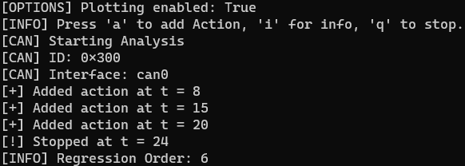
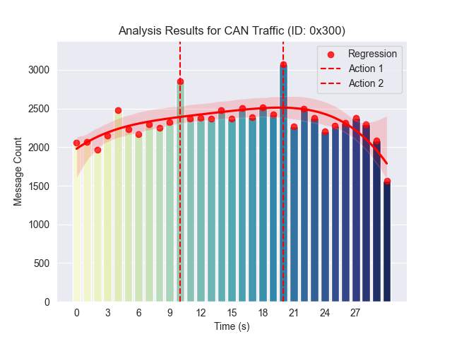
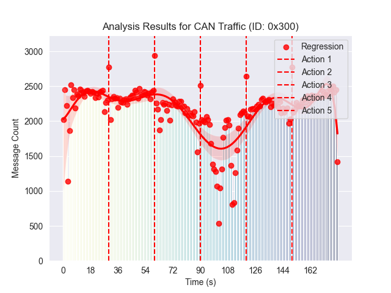
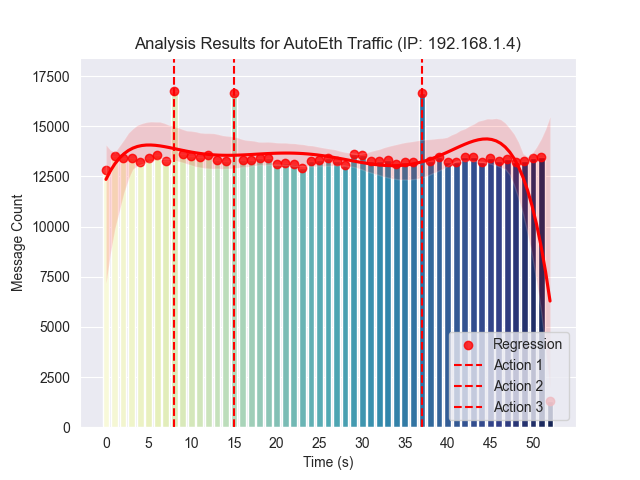

# Car Analysis (CARAL)

ML based in-car Bus traffic analysis. Using regression based analysis, this tool aims to assist the tester to reverse engineer the bus traffic and find the meaning/origin of the messages, respectively its associated ECU.

## Functionality

Add actions simultaneously to real actions triggered in the car. **Warning**: even though the tool supports infinite actions _theoratically_, the tool works best for less than 10 actions in one cycle. 



## Protocol Support

* CAN(-FD) (beta)
* Automotive Ethernet (work-in-progress)
* FlexRay (TbA)
* LIN (work-in-progress)

## Hardware Support

* Linux socketcan (beta)
* PEAK PCAN(-FD) (work-in-progress)
* EtherBadge (work-in-progress)

## Examples

### CAN

Config:

```bash
caral.py --plot --device socketcan can --iface can0 --id 0x300
```

#### Plot: CAN, 30s, 2 actions



#### Plot: CAN, 180s, 5 actions



### Automotive Ethernet

Config:

```bash
caral.py --plot --device etherbadge ae --iface eth1 --ip 192.168.1.4 --protocol udp
```

#### Plot: Automotive Ethernet, 52s, 3 actions



## Third Party Packages

* keyboard: catch keystrokes from user
* matplotlib, seaborn: Visualization
* numpy: Numerical operations, regression analysis
* pandas: DataFrames
* [scapy](https://scapy.readthedocs.io/en/latest/layers/automotive.html): Automotive protocol implementations
* [PCANBasic](https://www.peak-system.com/PCAN-Basic.239.0.html), [PLinApi](https://www.peak-system.com/PLIN-API.444.0.html): PEAK PCAN(-FD) and LIN API
